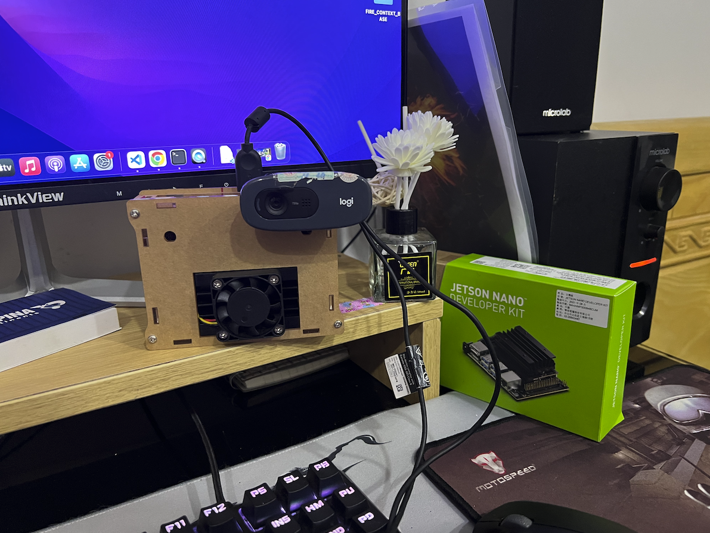
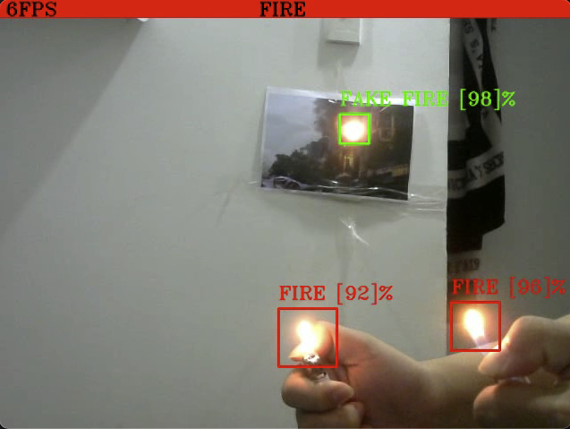

# FAKE FIRE DETECTOR

Becasuse fire alarm need to security staff go to area fire to verify and fire fighting. The questions are "Where" and "How".

To resolve that questions, I suggest use camera to tracking.

This repo is result of research about problem.

Context-base detector is used to detect fake or real fire with two model [AlexNet](https://en.wikipedia.org/wiki/AlexNet) and [SSD Mobilenet V2](https://ai.googleblog.com/2018/04/mobilenetv2-next-generation-of-on.html) and devploy to [NVIDIA Jetson Nano Developer Kit](https://developer.nvidia.com/embedded/jetson-nano-developer-kit)

## AlexNet

I train this model for detecting fire with my data and result in [fire_detect_large_data.ipynb](src/fire_detect_large_data.ipynb)

## SSD Mobilenet V2

I train this model for detecting fire with my data and result in [SSDMobileNet.ipynb](src/SSDMobileNet.ipynb)

## Devploy to NVIDIA Jetson Nano Developer Kit and test result

 

## Demo

[video demo PC](img/result_PC.mp4)
[video demo Jetson nano](img/result_jetson.mp4)

[video demo Jetson nano](img/result_jetson.mp4)

